# 🛍️ Shopivia (E-Commerce App) 

A modern Flutter E-Commerce application built with **MVVM Architecture** and **Repository Pattern**, featuring authentication, shopping cart, favorites, checkout, and order management. The app focuses on clean architecture, scalable code, and an optimized user experience.

---

## ✨ Features

### 🔐 Authentication
- Firebase Authentication
- Email & Password Sign In / Sign Up
- Persistent Login

### 🛒 Shopping
- Browse Products
- Product Details
- Categories
- Search Products
- Image Carousel
- Product Ratings & Reviews

### ❤️ Favorites
- Add / Remove Favorites
- User-specific favorites using Hive
- Optimistic UI Updates

### 🛍️ Cart
- Add / Remove Products
- Update Quantity
- Dynamic Total Price
- User-specific cart using Hive

### 💳 Checkout
- Shipping Information
- Order Summary
- Payment UI
- Place Order

### 📦 Orders
- Order History
- User-specific Orders
- Order Details

---

## 🏗️ Architecture

This project follows **MVVM Architecture** combined with the **Repository Pattern**.


## 🛠️ Tech Stack

- Flutter
- Dart
- Bloc / Cubit
- MVVM
- Repository Pattern
- Firebase Authentication
- Hive
- Dio

---


## 🌍 API

This application uses **DummyJSON API**.

https://dummyjson.com

---

## 📱 Screens

- Splash
- Login
- Register
- Home
- Product Details
- Categories
- Search
- Favorites
- Cart
- Checkout
- Orders
- Profile
- etc...

---

## 💾 Local Storage

Hive is used to cache user-specific data.

Each authenticated user has isolated local storage:

- favorites_<userId>
- cart_<userId>
- orders_<userId>

---

## 📸 Screenshots
| Splash                                               | Welcome                                                  |
| ---------------------------------------------------- | -------------------------------------------------------- |
| 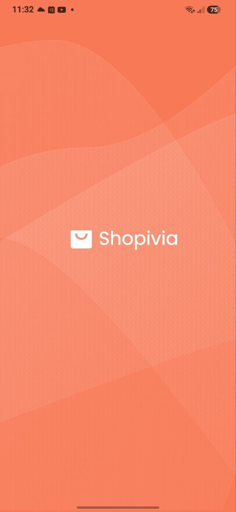             | 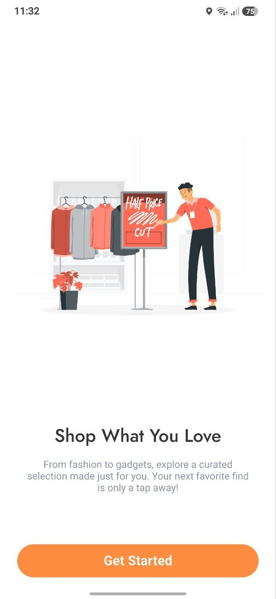               |

| Welcome 2                                            | Welcome 3                                                |
| ---------------------------------------------------- | -------------------------------------------------------- |
| 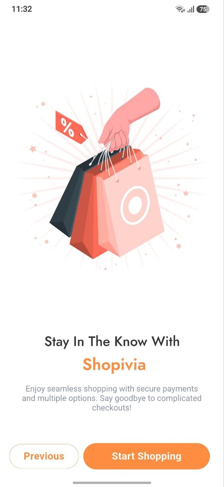          | 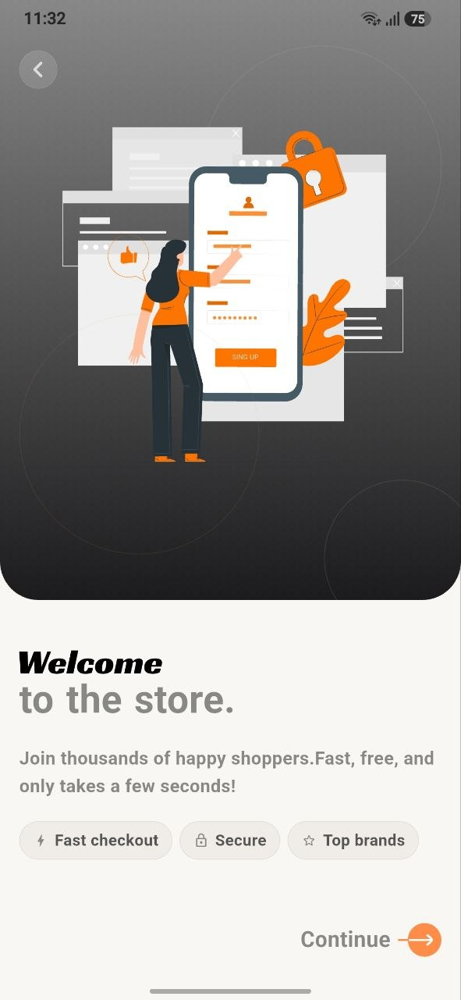              |

| Log In                                               | Sign up                                                  |
| ---------------------------------------------------- | -------------------------------------------------------- |
| 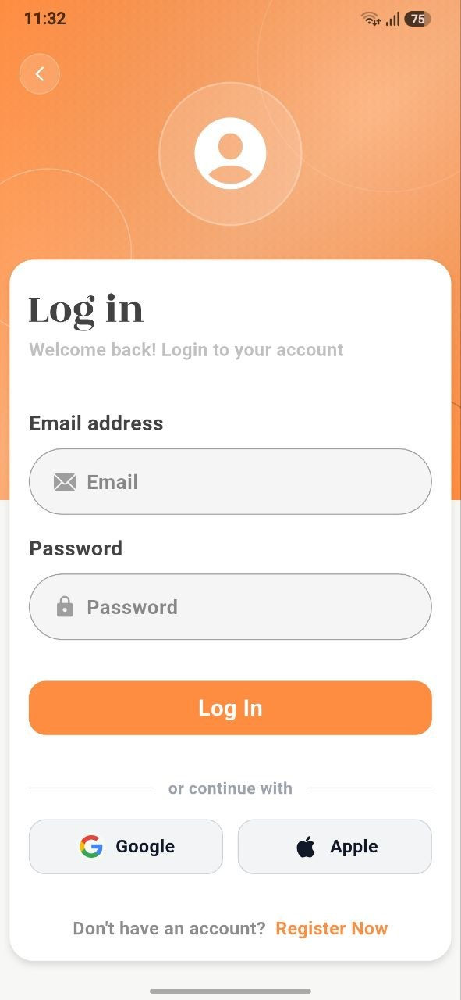             | 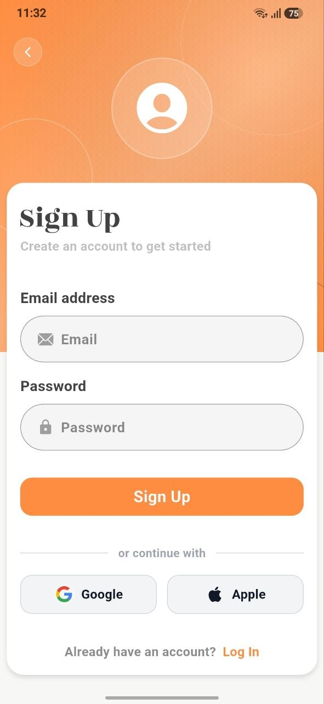               |

| Home page                                            | Home page 2                                              |
| ---------------------------------------------------- | -------------------------------------------------------- |
| 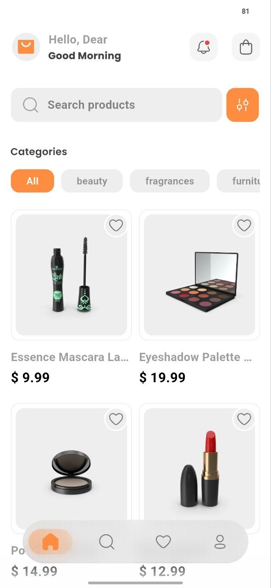                 | 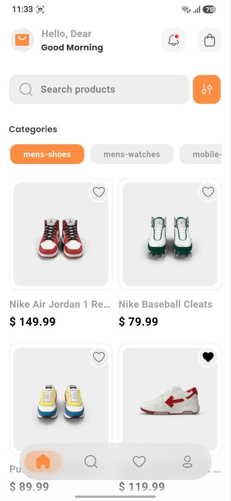                    |

| Search                                               | search 2                                                 |
| ---------------------------------------------------- | -------------------------------------------------------- |
| 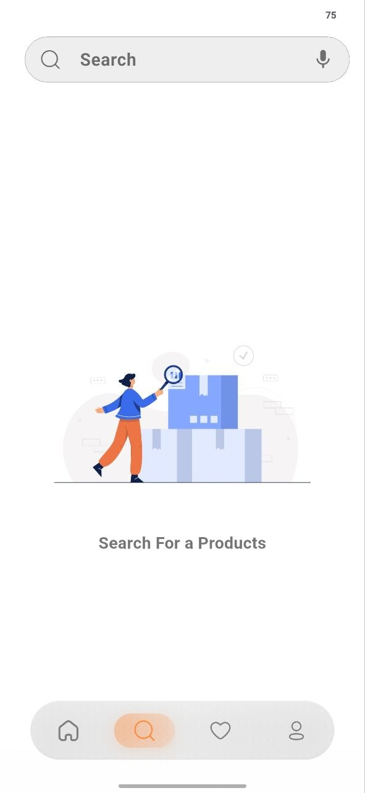            | 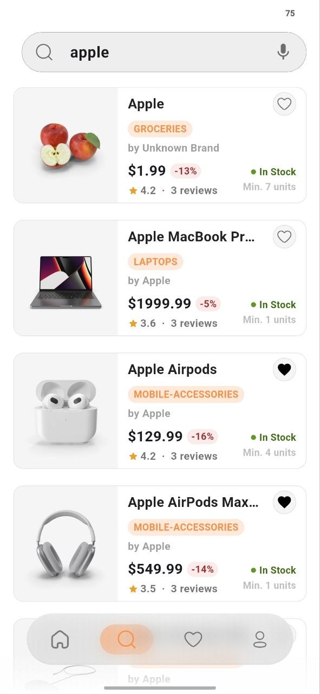                |

| Profile                                              | Cart                                                     |
| ---------------------------------------------------- | -------------------------------------------------------- |
| 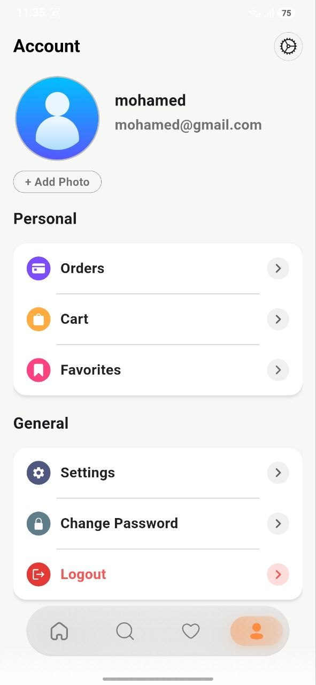           | 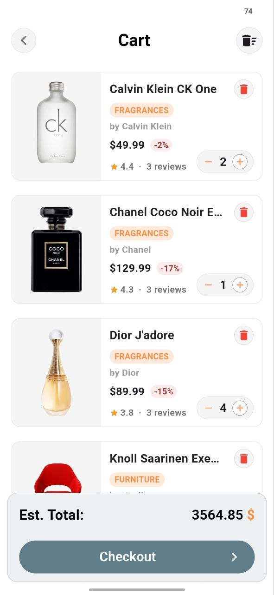                     |

| orders                                               | order details                                            |
| ---------------------------------------------------- | -------------------------------------------------------- |
| 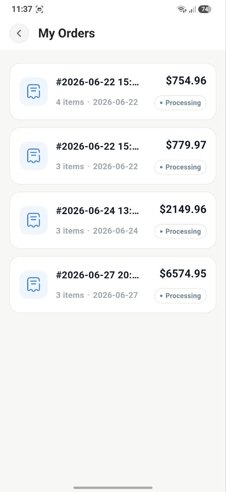             | 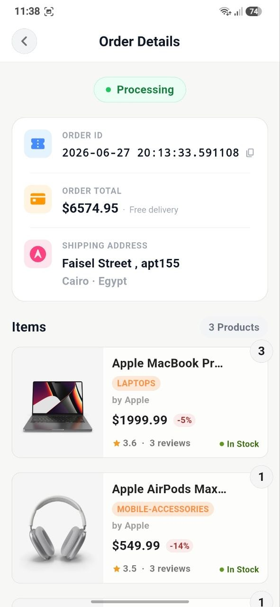 |

| orders details2                                      | checkout                                                 |
| ---------------------------------------------------- | -------------------------------------------------------- |
| 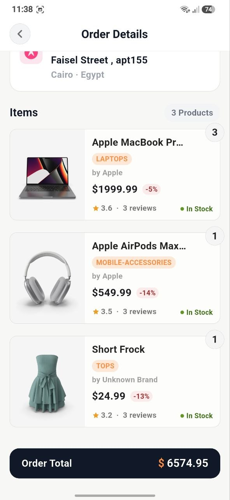    | 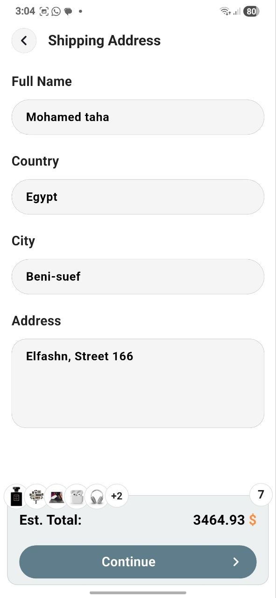            |

|   payment                                            | confirm order message                                    |
| ---------------------------------------------------- | -------------------------------------------------------- |
| 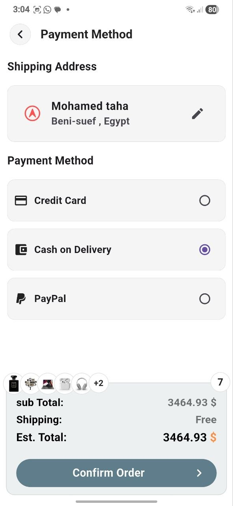           | 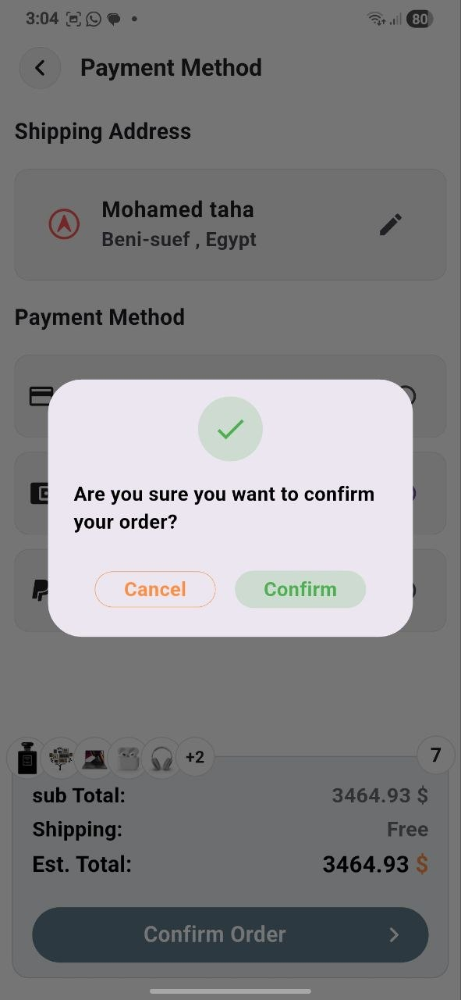        |

|   confirm page                                       | confirm page 2                                           |
| ---------------------------------------------------- | -------------------------------------------------------- |
| 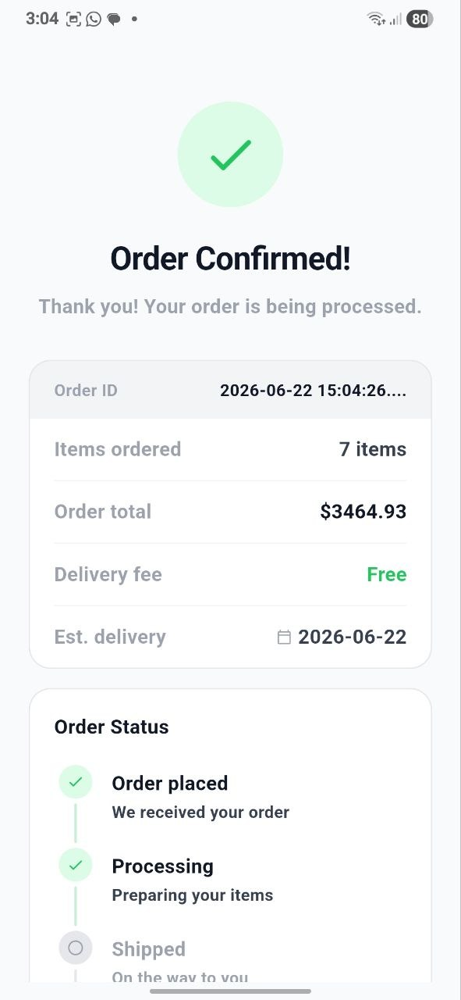      | 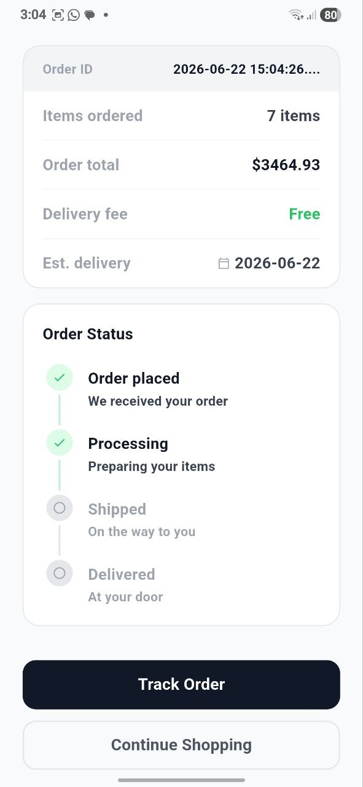        |

|   change password page                               | favourite page                                           |
| ---------------------------------------------------- | -------------------------------------------------------- |
| 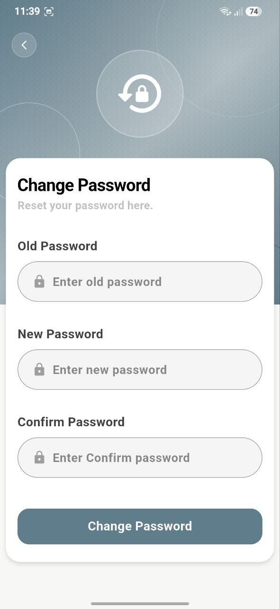   | 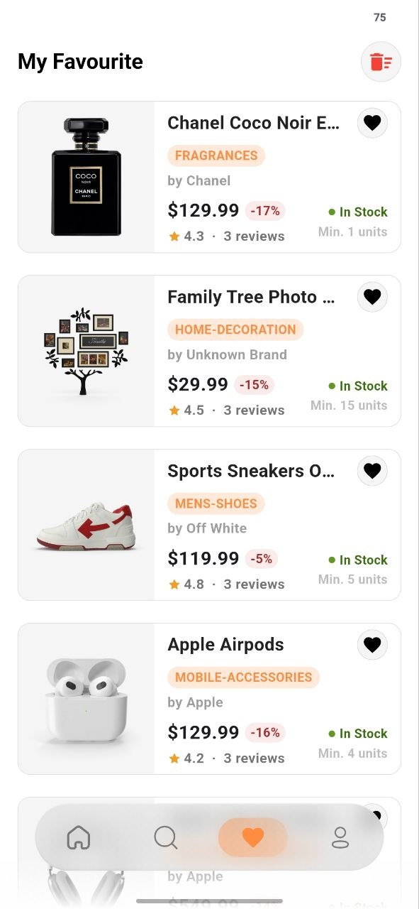                  |


---

## 🚀 Getting Started

```bash
git clone <repo_url>

flutter pub get

flutter run
```

---

## 👨‍💻 Developer

**Mohamed Taha**

Flutter Developer

- LinkedIn: https://www.linkedin.com/in/mohamed-taha164/
- Portfolio : https://muhamedtaha-dev.vercel.app/